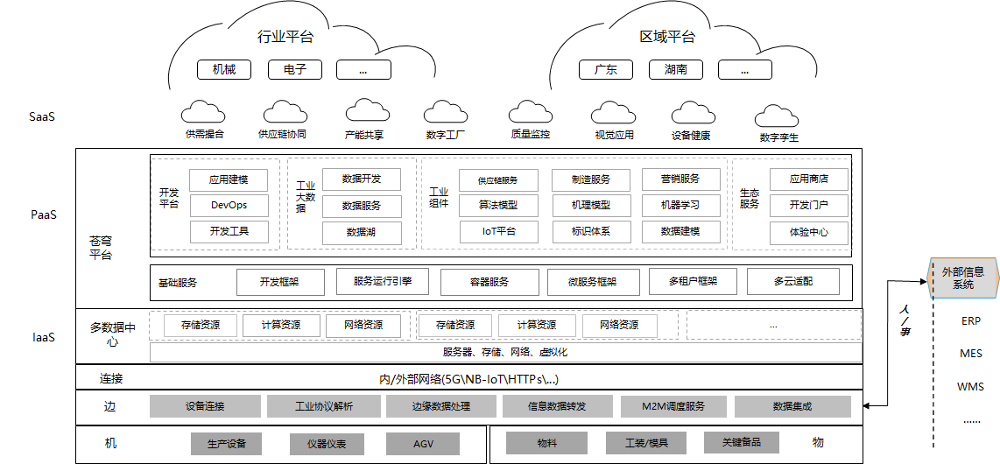

> # 产品

&emsp;&emsp;在进入这个板块进行的主要是一些相关的产品介绍，包括当前所在岗位所负责的一些产品，包括但不限于公司自研小程序、集团及本部下发的相关产品文件。

> # 工业互联网

&emsp;&emsp;“工业互联网”（Industrial Internet）——开放、全球化的网络，将人、数据和机器连接起来，属于泛互联网的目录分类。  它是全球工业系统与高级计算、分析、传感技术及互联网的高度融合。

&emsp;&emsp;“工业互联网”的概念最早由通用电气于2012年提出，随后美国五家行业龙头企业联手组建了工业互联网联盟(IIC)，将这一概念大力推广开来。除了通用电气这样的制造业巨头，加入该联盟的还有IBM、思科、英特尔和AT&T等IT企业，这里小小的提一下之前的几家公司都为**前通信运营商**。

&emsp;&emsp;工业互联网的本质和核心是通过工业互联网平台把设备、生产线、工厂、供应商、产品和客户紧密地连接融合起来。可以帮助制造业拉长产业链，形成跨设备、跨系统、跨厂区、跨地区的互联互通，从而提高效率，推动整个制造服务体系智能化。还有利于推动制造业融通发展，实现制造业和服务业之间的跨越发展，使工业经济各种要素资源能够高效共享。

> ## 云镝工业互联网平台

> ### 云镝工业互联网平台优势

+ 全面连接能力

&emsp;&emsp;提供ERP连接器、联通物联网平台连接、条码/FRID连接、云之家的全面连接

+ 全面应用能力

&emsp;&emsp;提供从工业电商交易到供应链、生产到产业链上全价值链应用

+ 核心技术能力

&emsp;&emsp;自主可控的微服务架构的PaaS与SaaS一体化技术

+ 数据处理能力

&emsp;&emsp;提供数据+模型的应用，通过机理模型、数字模型的构建，支持工厂模型化、数字化。

> ### 技术架构图

